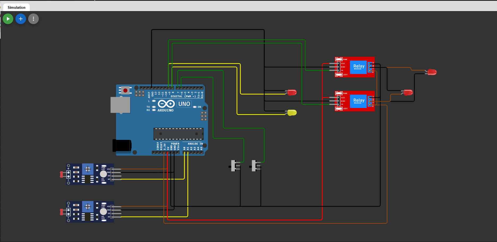

# HelioTrack 🌞🌗
**An Arduino-based Dual-LDR Solar Panel Tracker with Auto Return at Night**

HelioTrack is a smart solar panel positioning system that uses two LDRs (Light Dependent Resistors) and two limit switches to track the sun’s position from **east to west** during the day, and automatically returns the panel to its **home (east)** position at night. It uses relays to control the motor direction.

---

## 🛠️ Features

- 🧭 **Automatic Sun Tracking** using LDR difference
- 🌙 **Night Mode** return-to-home function
- 🔚 **Limit Switches** for safe mechanical boundaries
- 🔁 Uses **relays** to drive actuator or motor

---

## ⚙️ Components Used

| Component              | Quantity |
|------------------------|----------|
| Arduino Uno            | 1        |
| LDR (Photoresistor)    | 2        |
| Relay Module           | 2        |
| Slide Switch (Limit)   | 2        |
| LED (Indicator)        | 2        |
| 10k Resistors          | 2        |
| Motor (Actuator)       | 1        |
| Power Supply (5V)      | 1        |

---

## 🔌 Circuit Diagram

> You can run and edit the simulation directly in Wokwi:  
👉 [Open Simulation in Wokwi]([https://wokwi.com/projects/YOUR_PROJECT_ID](https://wokwi.com/projects/433727322507141121))



---

## 🧠 Logic Overview

1. **Daytime Operation**:
   - Compares light intensity from LDR_EAST and LDR_WEST.
   - If significant difference (>300), rotates panel **toward brighter side**.
   - Stops if no difference or if a **limit switch is triggered**.

2. **Night Mode**:
   - If both LDRs detect darkness, returns panel to **EAST** (home) position.
   - Uses `limitEast` to detect return point.

3. **Relays**:
   - Relay 1 → Controls EAST movement.
   - Relay 2 → Controls WEST movement.

---

## 🧾 Code Summary

> File: `heliotrack.ino`

```cpp
#define RELAY_EAST 8
#define RELAY_WEST 9
#define LIMIT_EAST 6
#define LIMIT_WEST 7
#define LDR_EAST A0
#define LDR_WEST A1

// Full logic with logs included in the repo
